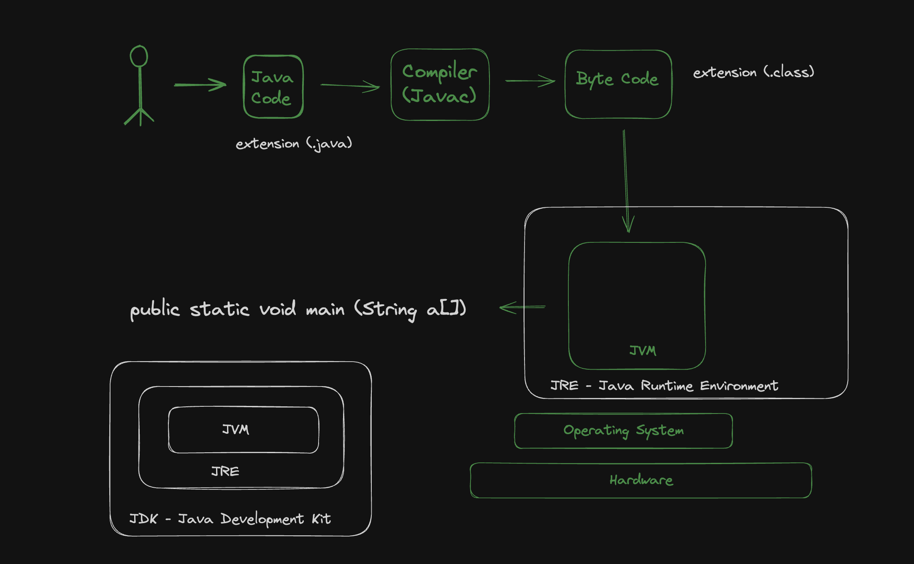
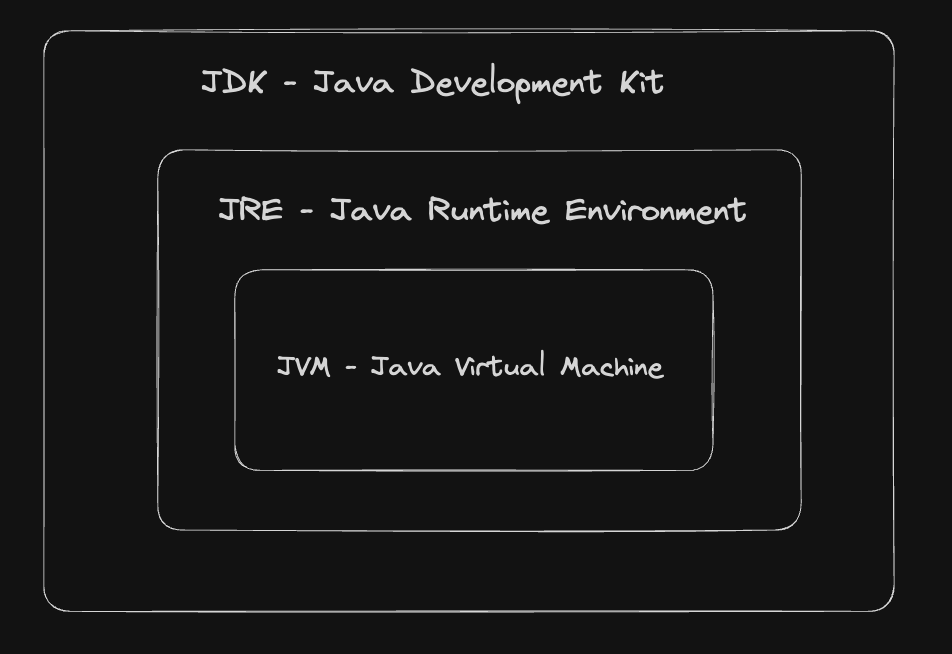
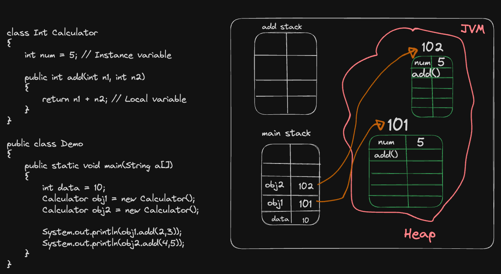

## Java Tutorial

### Introduction
JVM - Java Virtual Machine
WORA - Write Once Run Anywhere
Java - Java was created at Sun Microsystems Inc in 1995
Java code is platform independent, but JVM is not platform independent. JVM for windows, mac or linux are different.

### Java Development Kit setup
* IDE (Integrated Development Environment) for Java - VS Code Editor (https://code.visualstudio.com/)
* Java Downloads - JDK Development Kit (https://www.oracle.com/java/technologies/downloads/)
```
Check java version
$ java --version
java compiler
$ javac --version
```

### First code in java
* VSCode Extensions:
1. Extension Pack for Java

* JShell for experimenting java code
```
$ jshell

jshell> 2 + 3
jshell> System.out.print("Hello world");
```
### How Java Works

* Run java file

```
First create a byte file
$ javac Hello.java
Run the Byte file using class name
$ java Hello
```

```
In short way to run java file
$ java Hello.java 
This run the above 2 steps under the hood, first compile and create java class using javac and then run the class using java
```

### Variables in java
* Java is strongly types language
* Variable assignment in java:
data_type (int/string/boolean) variable_name = value;

### Data Types in java
* Primitive Type
    - Integer (byte - 1byte(-2^7 to 2^7 - 1), short - 2bytes, integer - 4bytes, long - 8bytes)
    - Float (float - 4bytes, double - 8bytes)
    - Character - 2bytes (Supports UNICODE)
    - Boolean - (True or False)

### Type Conversion & Casting in java
Type Conversion -> Automatically one type of data is assigning to another type is called type conversion
```
byte b = 127;
int a = 256;
b = a -> this will not work
a = b -> this will work
```

Type Casting -> Explicitly convert one type of data into another type is called type casting
```
float f = 5.6f;
int x = (int) f;
```

### Assignment Operators
Assignment Operators are: +, -, *, /, %, +=, -=, *=, /=, %=, ++ (incrementing operator), -- (decrementing operator)
    - Pre-incrementing: ++a
    - Post-incrementing: a++
    - Pre-decrementing: --a
    - Post-decrementing: a--

### Relational Operators
Relational Operators are: <, >, ==, !=, <=, >=

### Logical Operators
Logical Operators are: AND -> &&, OR -> ||, NOT -> !

### Conditional Statements
if-else statement:
```
if (condition) {
    // Code ....
} else {
    // Code ...
}
```

if-else if statement:
```
if (condition){
    // code ...
} else if (condition){
    // code ....
} else {
    // Code ....
}
```

Ternary Operator: 
codition ? if condition is true then it will be run : other than if the condition is false then run this

### Switch Statement in java
```
public class Demo {
    public static void main(String a[]){
        int n = 8;
        switch(n){
            case 1:
                System.out.println("Monday");
                break;
            case 2:
                System.out.println("Tuesday");
                break;
            case 3: 
                System.out.println("Wednesday");
                break;
            case 4:
                System.out.println("Thursday");
                break;
            case 5:
                System.out.println("Friday");
                break;
            case 6:
                System.out.println("Saturday");
                break;
            case 7:
                System.out.println("Sunday");
                break;
            default:
                System.out.println("Please enter a valid number")
        }
    }
}
```

### While Loop
```
while(condition)
{
    // Code....
    Increment/decrement;
}
```

### Do While Loop
```
do 
{
    // Code ....
    increment/decrement;
}while(condition);
```

### For loop
```
for(initialization; condition; increment/decrement)
{
    // Code ....
}
```

### Object Oriented Programming in Java
* Object - Properties & Behaviours (methods)
* Class
* JVM create objects from java class

### JDK, JRE & JVM


### Stack and Heap
In the Java Virtual Machine (JVM), stack and heap are two types of memory that the JVM allocates to store different types of data.
* Heap: Used to store objects and class instances, and is created by the JVM when it starts. Heap memory is used by all parts of the application and can store larger amounts of data. Heap memory is more flexible and can be accessed at any time, but it's also more complex because it's used globally. 

* Stack: Used for the execution of a thread, and is temporary memory when variables values are stored when their methods are invoked. Stack memory is thread specific and each thread has its own stack. Stack is a linear data structure that stores items in last in first out (LIFO) manner. Stack memory is used to manage method calls and local variables.

* Local variable: An auxiliary temporary variable that exists only while a particular function or a block of statements is executed.

* Instance variable: Is a class property that can be different for each object.



### Array
* One dimensional array
```
int num[] = {1,2,3};
int num1[] = new int[4];
```

* Multi dimensional array
```
int num2[][] = new int[3][4];
```

* Loop through multi-dimensional array
```
int num2[][] = new int[3][4];

for(int n[]: num2)
{
    for(int m: n)
    {
        System.out.println(m);
    }
}
```