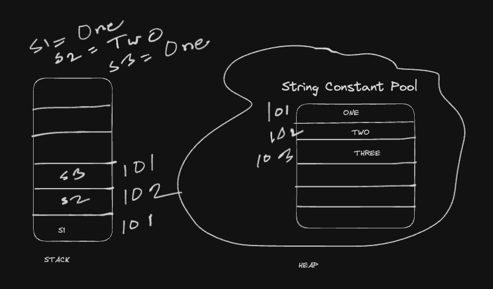

## Java Tutorial

### Introduction
JVM - Java Virtual Machine
WORA - Write Once Run Anywhere
Java - Java was created at Sun Microsystems Inc in 1995
Java code is platform independent, but JVM is not platform independent. JVM for windows, mac or linux are different.

### Java Development Kit setup
* IDE (Integrated Development Environment) for Java - VS Code Editor (https://code.visualstudio.com/)
* Java Downloads - JDK Development Kit (https://www.oracle.com/java/technologies/downloads/)
```
Check java version
$ java --version
java compiler
$ javac --version
```

### First code in java
* VSCode Extensions:
1. Extension Pack for Java

* JShell for experimenting java code
```
$ jshell

jshell> 2 + 3
jshell> System.out.print("Hello world");
```
### How Java Works

* Run java file

```
First create a byte file
$ javac Hello.java
Run the Byte file using class name
$ java Hello
```

```
In short way to run java file
$ java Hello.java 
This run the above 2 steps under the hood, first compile and create java class using javac and then run the class using java
```

### Variables in java
* Java is strongly types language
* Variable assignment in java:
data_type (int/string/boolean) variable_name = value;

### Data Types in java
* Primitive Type
    - Integer (byte - 1byte(-2^7 to 2^7 - 1), short - 2bytes, integer - 4bytes, long - 8bytes)
    - Float (float - 4bytes, double - 8bytes)
    - Character - 2bytes (Supports UNICODE)
    - Boolean - (True or False)

### Type Conversion & Casting in java
Type Conversion -> Automatically one type of data is assigning to another type is called type conversion
```
byte b = 127;
int a = 256;
b = a -> this will not work
a = b -> this will work
```

Type Casting -> Explicitly convert one type of data into another type is called type casting
```
float f = 5.6f;
int x = (int) f;
```

### Assignment Operators
Assignment Operators are: +, -, *, /, %, +=, -=, *=, /=, %=, ++ (incrementing operator), -- (decrementing operator)
    - Pre-incrementing: ++a
    - Post-incrementing: a++
    - Pre-decrementing: --a
    - Post-decrementing: a--

### Relational Operators
Relational Operators are: <, >, ==, !=, <=, >=

### Logical Operators
Logical Operators are: AND -> &&, OR -> ||, NOT -> !

### Conditional Statements
if-else statement:
```
if (condition) {
    // Code ....
} else {
    // Code ...
}
```

if-else if statement:
```
if (condition){
    // code ...
} else if (condition){
    // code ....
} else {
    // Code ....
}
```

Ternary Operator: 
codition ? if condition is true then it will be run : other than if the condition is false then run this

### Switch Statement in java
```
public class Demo {
    public static void main(String a[]){
        int n = 8;
        switch(n){
            case 1:
                System.out.println("Monday");
                break;
            case 2:
                System.out.println("Tuesday");
                break;
            case 3: 
                System.out.println("Wednesday");
                break;
            case 4:
                System.out.println("Thursday");
                break;
            case 5:
                System.out.println("Friday");
                break;
            case 6:
                System.out.println("Saturday");
                break;
            case 7:
                System.out.println("Sunday");
                break;
            default:
                System.out.println("Please enter a valid number")
        }
    }
}
```

### While Loop
```
while(condition)
{
    // Code....
    Increment/decrement;
}
```

### Do While Loop
```
do 
{
    // Code ....
    increment/decrement;
}while(condition);
```

### For loop
```
for(initialization; condition; increment/decrement)
{
    // Code ....
}
```

### Object Oriented Programming in Java
* Object - Properties & Behaviours (methods)
* Class
* JVM create objects from java class

### JDK, JRE & JVM


### Stack and Heap
In the Java Virtual Machine (JVM), stack and heap are two types of memory that the JVM allocates to store different types of data.
* Heap: Used to store objects and class instances, and is created by the JVM when it starts. Heap memory is used by all parts of the application and can store larger amounts of data. Heap memory is more flexible and can be accessed at any time, but it's also more complex because it's used globally. 

* Stack: Used for the execution of a thread, and is temporary memory when variables values are stored when their methods are invoked. Stack memory is thread specific and each thread has its own stack. Stack is a linear data structure that stores items in last in first out (LIFO) manner. Stack memory is used to manage method calls and local variables.

* Local variable: An auxiliary temporary variable that exists only while a particular function or a block of statements is executed.

* Instance variable: Is a class property that can be different for each object.


### Array
* One dimensional array
```
int num[] = {1,2,3};
int num1[] = new int[4];
```

* Multi dimensional array
```
int num2[][] = new int[3][4];
```

* Loop through multi-dimensional array
```
int num2[][] = new int[3][4];

for(int n[]: num2)
{
    for(int m: n)
    {
        System.out.println(m);
    }
}
```

### Drawbacks of array in java
* Fixed size
* Lack of flexibility
* Inefficient Insertions & Deletions
* Limited methods
* Memory Wastage
* Inability to Resize
* Homogeneous Data Types
* Limited support of Functional Programming
* Difficulty in Sorting & Searching

### String in Java


### Mutable vs Immutable
Mutable String: The mutable objects are objects whose value can be changed after initialization.
Immutable String: The immutable objects are objects whose value can not be changed after initialization.
String class is an immutable class

### String Buffer vs String Builder
StringBuffer and StringBuilder classes are mutable.
String Buffer: String buffer is a peer class of string that provides much of the functionality of strings. StringBuffer represents growable and writable character sequences.
```
StringBuffer str = new StringBuffer("Hello World");
```
StringBuilder: Similar to StringBuffer, the StringBuilder in java represents a mutable sequence of characters. It creates a mutable sequence of characters.
```
StringBuilder str = new StringBuilder("Hello World");
```

### Assigning StringBuffer data into String
```
StringBuffer sb = new StringBuffer("Hello World");
String str = sb.toString();
```

### Difference between StringBuffer and StringBuilder
* StringBuffer is thread safe. It means two threads can't call the methods of StringBuffer simultaneously. But StringBuilder is not thread safe. It means two threads can call the methods of StringBuilder simultaneously.
* StringBuffer is less efficient than StringBuilder

### Static Variable
When a variable is declared static, it means that the variable belongs to the class itself rather than to any specific instance of the class.

```
class Mobile {
    static String name; // This static variable is called class variable
    String brand; // This variable is called instance variable
}

public class Demo {
    public static void main(String a[]){
        Mobile mobile = new Mobile();
        mobile.brand = "Apple";
        Mobile.name = "iPhone";

        System.out.println(mobile.brand);
        System.out.println(Mobile.name);
    }
}
```

### Static Block
A static block is a set of instructions that is run only once when a class is loaded into memory.
There are two steps:
* Class Loads
* Objects are instantiated.

```
class Mobile {
    String brand;
    int price;
    static String name;

    // Static Block - executes only once when the class is loaded
    static {
        name = "Phone";
    }

    // Constructor - executes every time when any instance is created
    public Mobile() {
        brand = "";
        price = 200;
    }
}
```

* Class.forName(class_name); -> To load any class in memory

### Static Method
Static method is a method which belongs to the class and not to the object. A static method can access only static data. A static method can call only other static methods and can not call a not-static method from it.

```
class Mobile {
    String brand;
    int price;
    static String name;

    public void show() {
        System.out.println(brand + " : " + price + " : " + name);
    }

    public static void show1(Mobile obj){
        System.out.println(obj.brand + " : " + obj.price + " : " + name);
    }
}

public class Demo {
    public static void main(String a[]){
        Mobile obj1 = new Mobile();

        obj1.show();
        Mobile.show1();
    }
}
```

### Encapsulation
In encapsulation, a class's variables are hidden from other classes and can only be accessed by the methods of the class in which the are found.

```
class Human 
{
    private int age;
    private String name;

    public int getAge(){
        return age;
    }

    public void setAge(int a){
        this.age = a;
    }

    public String getName(){
        return name;
    }

    public void setName(String n){
        this.name = n;
    }
}

class Demo
{
    public static void main(String a[]){
        Human human = new Human();

        human.setName("Yeasin");
        human.setAge(25);

        System.out.println(human.getName + " : " + human.getAge);
    }
}
```

### this keyword in java
This keyword refers to the current object in a method or constructor.

### constructor in java
```
class Human 
{
    private String name;

    public Human(){
        this.name = 'Yeasin'
    }

    public Human(String name){
        this.name = name;
    }

    public String getName(){
        return this.name;
    }
}

class Demo
{
    public static void main(String a[]){
        Human human1 = new Human();
        Human human2 = new Human("Arafath");

        System.out.println(human1.getName());
        System.out.println(human2.getName());
    }
}
```

### super() vs this() in java
super keyword & super() constructor: A reserved keyword used to call the base class methods or variable is known as a super keyword. We cannot use the super keyword as an identifier. The super keyword is not only used to refer to the base class instance but also static members too.

The super() is mainly used for invoking base class member functions and constructors.

```
class Animal {
    String color = white";
}

class Cat extends Animal {
    Cat(){
        String color = "Brown";
        System.out.println("The cat is of color: " + super.color);
        System.out.println("The cat is of color " + color);
    }
}

class SuperClassExample extends Cat {
    SuperClassExample(){
        super();
        System.out.println("The eyes of the cat is blue.");
    }
}
```

this() constructor: this() constructor refers to the current class object.

```
class ThisExample {
    int x = 5;
    staticinty = 10;

    ThisExample() {
        this(5);
        System.out.println(We are inside of the default constructor);
        System.out.println("The value of x = " + x);
    }

    ThisExample(int x) {
        this.x = x;
        System.out.println("We are inside of the parameterized constructor");
        System.out.println("The value of x " + x);
    }
}
```

*** Note: Every class extends Object class & every constructor calls super() if we don't defined.

### Naming convention in java
* Camel casing
* class name should be start with Capital (example: Calculator, Runable)
* Variable methods name should be start with small-letters (example: showMyMarks, fixedDeposit)
* Constant should be all Capital. (example: PIE, BRAND)

### Anonymous Object
An anonymous object is an object that is created without giving it a name. Anonymous objects are often used to create objects on the fly and pass them as arguments to methods.

```
class Person {
    String name;
    int age;

    Person(String name, int age) {
        this.name = name;
        this.age = age;
    }

    public void display() {
        System.out.println("Name: " + this.name + ", Age: " + age);
    }
}

public class Main {
    public static void main(String[] args) {
        new Person("John", 20).display();
    }
}
```

### Inheritance
Inheritance is the mechanism by which one class(child, sub, derived) is allowed to inherit the features(fields and methods) of another class(Parent, super, base). In java inheritance means creating new classes based on existing ones. A class that inherits from another class can reuse the methods and fields of that class. In addition, can add new fields and methods to current class as well.

##### Why do we need java inheritance?
* Code reusability
* Method overriding
* Abstraction

```
class Calculator {
    public int add(int num1, int num2){
        return num1 + num2;
    }

    public int sub(int num1, int num2){
        return num1 - num2;
    }
}

class AdvancedCalculator extends Calculator {
    public int mult(int num1, int num2) {
        return num1 * num2;
    }
}
```

* Single level inheritance: Calc -> AdvCalc
* Multi-level inheritance: Calc -> AdvCalc -> VeryAdvCalc
* Java does not support multiple inheritance. 

### Method Overriding
Overriding is a feature that allows a subclass or child class to provide a specific implementation of a method that is already provided by one of its super-classes or parent classes. When a method in a subclass has the same name, te same parameters or signature and the same return type as a method in its super class then the method in the subclass is said to override the method in the super class.

```
class Parent {
    void show() {
        System.out.println("Parents show()");
    }
}

class Child extends Parent {
    @Override
    void show() {
        System.out.println("Childs show()");
    }
}
```

### Package
A set of classes and interfaces grouped together are known as Packages in Java. Packages are used to avoid name conflict and to write a better maintainable code. Packages are divided into two categories:
* Built-in packages
* Used-defined packages

##### Built-in Packages
THe Java Api is a library of prewritten classes. 
```
# Import a package
import java.util.*;

# Import a class
import java.util.Scanner;
```

##### User defined packages
```
package mypack;

class MyPackageClass {
    public static void main(String[] args) {
        
    }
}
```