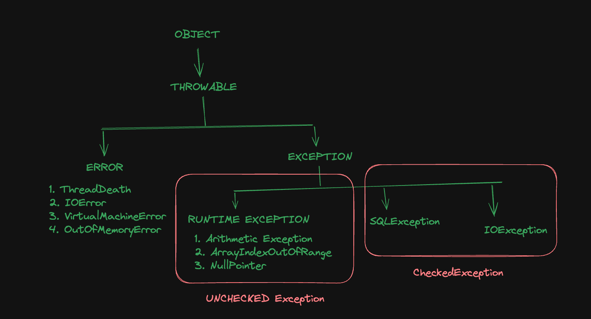

## Java Tutorial

### Introduction
JVM - Java Virtual Machine
WORA - Write Once Run Anywhere
Java - Java was created at Sun Microsystems Inc in 1995
Java code is platform independent, but JVM is not platform independent. JVM for windows, mac or linux are different.

### Java Development Kit setup
* IDE (Integrated Development Environment) for Java - VS Code Editor (https://code.visualstudio.com/)
* Java Downloads - JDK Development Kit (https://www.oracle.com/java/technologies/downloads/)
```
Check java version
$ java --version
java compiler
$ javac --version
```

### First code in java
* VSCode Extensions:
1. Extension Pack for Java

* JShell for experimenting java code
```
$ jshell

jshell> 2 + 3
jshell> System.out.print("Hello world");
```
### How Java Works

* Run java file

```
First create a byte file
$ javac Hello.java
Run the Byte file using class name
$ java Hello
```

```
In short way to run java file
$ java Hello.java 
This run the above 2 steps under the hood, first compile and create java class using javac and then run the class using java
```

### Variables in java
* Java is strongly types language
* Variable assignment in java:
data_type (int/string/boolean) variable_name = value;

### Data Types in java
* Primitive Type
    - Integer (byte - 1byte(-2^7 to 2^7 - 1), short - 2bytes, integer - 4bytes, long - 8bytes)
    - Float (float - 4bytes, double - 8bytes)
    - Character - 2bytes (Supports UNICODE)
    - Boolean - (True or False)

### Type Conversion & Casting in java
Type Conversion -> Automatically one type of data is assigning to another type is called type conversion
```
byte b = 127;
int a = 256;
b = a -> this will not work
a = b -> this will work
```

Type Casting -> Explicitly convert one type of data into another type is called type casting
```
float f = 5.6f;
int x = (int) f;
```

### Assignment Operators
Assignment Operators are: +, -, *, /, %, +=, -=, *=, /=, %=, ++ (incrementing operator), -- (decrementing operator)
    - Pre-incrementing: ++a
    - Post-incrementing: a++
    - Pre-decrementing: --a
    - Post-decrementing: a--

### Relational Operators
Relational Operators are: <, >, ==, !=, <=, >=

### Logical Operators
Logical Operators are: AND -> &&, OR -> ||, NOT -> !

### Conditional Statements
if-else statement:
```
if (condition) {
    // Code ....
} else {
    // Code ...
}
```

if-else if statement:
```
if (condition){
    // code ...
} else if (condition){
    // code ....
} else {
    // Code ....
}
```

Ternary Operator: 
codition ? if condition is true then it will be run : other than if the condition is false then run this

### Switch Statement in java
```
public class Demo {
    public static void main(String a[]){
        int n = 8;
        switch(n){
            case 1:
                System.out.println("Monday");
                break;
            case 2:
                System.out.println("Tuesday");
                break;
            case 3: 
                System.out.println("Wednesday");
                break;
            case 4:
                System.out.println("Thursday");
                break;
            case 5:
                System.out.println("Friday");
                break;
            case 6:
                System.out.println("Saturday");
                break;
            case 7:
                System.out.println("Sunday");
                break;
            default:
                System.out.println("Please enter a valid number")
        }
    }
}
```

### While Loop
```
while(condition)
{
    // Code....
    Increment/decrement;
}
```

### Do While Loop
```
do 
{
    // Code ....
    increment/decrement;
}while(condition);
```

### For loop
```
for(initialization; condition; increment/decrement)
{
    // Code ....
}
```

### Object Oriented Programming in Java
* Object - Properties & Behaviours (methods)
* Class
* JVM create objects from java class

### JDK, JRE & JVM


### Stack and Heap
In the Java Virtual Machine (JVM), stack and heap are two types of memory that the JVM allocates to store different types of data.
* Heap: Used to store objects and class instances, and is created by the JVM when it starts. Heap memory is used by all parts of the application and can store larger amounts of data. Heap memory is more flexible and can be accessed at any time, but it's also more complex because it's used globally. 

* Stack: Used for the execution of a thread, and is temporary memory when variables values are stored when their methods are invoked. Stack memory is thread specific and each thread has its own stack. Stack is a linear data structure that stores items in last in first out (LIFO) manner. Stack memory is used to manage method calls and local variables.

* Local variable: An auxiliary temporary variable that exists only while a particular function or a block of statements is executed.

* Instance variable: Is a class property that can be different for each object.


### Array
* One dimensional array
```
int num[] = {1,2,3};
int num1[] = new int[4];
```

* Multi dimensional array
```
int num2[][] = new int[3][4];
```

* Loop through multi-dimensional array
```
int num2[][] = new int[3][4];

for(int n[]: num2)
{
    for(int m: n)
    {
        System.out.println(m);
    }
}
```

### Drawbacks of array in java
* Fixed size
* Lack of flexibility
* Inefficient Insertions & Deletions
* Limited methods
* Memory Wastage
* Inability to Resize
* Homogeneous Data Types
* Limited support of Functional Programming
* Difficulty in Sorting & Searching

### String in Java


### Mutable vs Immutable
Mutable String: The mutable objects are objects whose value can be changed after initialization.
Immutable String: The immutable objects are objects whose value can not be changed after initialization.
String class is an immutable class

### String Buffer vs String Builder
StringBuffer and StringBuilder classes are mutable.
String Buffer: String buffer is a peer class of string that provides much of the functionality of strings. StringBuffer represents growable and writable character sequences.
```
StringBuffer str = new StringBuffer("Hello World");
```
StringBuilder: Similar to StringBuffer, the StringBuilder in java represents a mutable sequence of characters. It creates a mutable sequence of characters.
```
StringBuilder str = new StringBuilder("Hello World");
```

### Assigning StringBuffer data into String
```
StringBuffer sb = new StringBuffer("Hello World");
String str = sb.toString();
```

### Difference between StringBuffer and StringBuilder
* StringBuffer is thread safe. It means two threads can't call the methods of StringBuffer simultaneously. But StringBuilder is not thread safe. It means two threads can call the methods of StringBuilder simultaneously.
* StringBuffer is less efficient than StringBuilder

### Static Variable
When a variable is declared static, it means that the variable belongs to the class itself rather than to any specific instance of the class.

```
class Mobile {
    static String name; // This static variable is called class variable
    String brand; // This variable is called instance variable
}

public class Demo {
    public static void main(String a[]){
        Mobile mobile = new Mobile();
        mobile.brand = "Apple";
        Mobile.name = "iPhone";

        System.out.println(mobile.brand);
        System.out.println(Mobile.name);
    }
}
```

### Static Block
A static block is a set of instructions that is run only once when a class is loaded into memory.
There are two steps:
* Class Loads
* Objects are instantiated.

```
class Mobile {
    String brand;
    int price;
    static String name;

    // Static Block - executes only once when the class is loaded
    static {
        name = "Phone";
    }

    // Constructor - executes every time when any instance is created
    public Mobile() {
        brand = "";
        price = 200;
    }
}
```

* Class.forName(class_name); -> To load any class in memory

### Static Method
Static method is a method which belongs to the class and not to the object. A static method can access only static data. A static method can call only other static methods and can not call a not-static method from it.

```
class Mobile {
    String brand;
    int price;
    static String name;

    public void show() {
        System.out.println(brand + " : " + price + " : " + name);
    }

    public static void show1(Mobile obj){
        System.out.println(obj.brand + " : " + obj.price + " : " + name);
    }
}

public class Demo {
    public static void main(String a[]){
        Mobile obj1 = new Mobile();

        obj1.show();
        Mobile.show1();
    }
}
```

### Encapsulation
In encapsulation, a class's variables are hidden from other classes and can only be accessed by the methods of the class in which the are found.

```
class Human 
{
    private int age;
    private String name;

    public int getAge(){
        return age;
    }

    public void setAge(int a){
        this.age = a;
    }

    public String getName(){
        return name;
    }

    public void setName(String n){
        this.name = n;
    }
}

class Demo
{
    public static void main(String a[]){
        Human human = new Human();

        human.setName("Yeasin");
        human.setAge(25);

        System.out.println(human.getName + " : " + human.getAge);
    }
}
```

### this keyword in java
This keyword refers to the current object in a method or constructor.

### constructor in java
```
class Human 
{
    private String name;

    public Human(){
        this.name = 'Yeasin'
    }

    public Human(String name){
        this.name = name;
    }

    public String getName(){
        return this.name;
    }
}

class Demo
{
    public static void main(String a[]){
        Human human1 = new Human();
        Human human2 = new Human("Arafath");

        System.out.println(human1.getName());
        System.out.println(human2.getName());
    }
}
```

### super() vs this() in java
super keyword & super() constructor: A reserved keyword used to call the base class methods or variable is known as a super keyword. We cannot use the super keyword as an identifier. The super keyword is not only used to refer to the base class instance but also static members too.

The super() is mainly used for invoking base class member functions and constructors.

```
class Animal {
    String color = white";
}

class Cat extends Animal {
    Cat(){
        String color = "Brown";
        System.out.println("The cat is of color: " + super.color);
        System.out.println("The cat is of color " + color);
    }
}

class SuperClassExample extends Cat {
    SuperClassExample(){
        super();
        System.out.println("The eyes of the cat is blue.");
    }
}
```

this() constructor: this() constructor refers to the current class object.

```
class ThisExample {
    int x = 5;
    staticinty = 10;

    ThisExample() {
        this(5);
        System.out.println(We are inside of the default constructor);
        System.out.println("The value of x = " + x);
    }

    ThisExample(int x) {
        this.x = x;
        System.out.println("We are inside of the parameterized constructor");
        System.out.println("The value of x " + x);
    }
}
```

*** Note: Every class extends Object class & every constructor calls super() if we don't defined.

### Naming convention in java
* Camel casing
* class name should be start with Capital (example: Calculator, Runable)
* Variable methods name should be start with small-letters (example: showMyMarks, fixedDeposit)
* Constant should be all Capital. (example: PIE, BRAND)

### Anonymous Object
An anonymous object is an object that is created without giving it a name. Anonymous objects are often used to create objects on the fly and pass them as arguments to methods.

```
class Person {
    String name;
    int age;

    Person(String name, int age) {
        this.name = name;
        this.age = age;
    }

    public void display() {
        System.out.println("Name: " + this.name + ", Age: " + age);
    }
}

public class Main {
    public static void main(String[] args) {
        new Person("John", 20).display();
    }
}
```

### Inheritance
Inheritance is the mechanism by which one class(child, sub, derived) is allowed to inherit the features(fields and methods) of another class(Parent, super, base). In java inheritance means creating new classes based on existing ones. A class that inherits from another class can reuse the methods and fields of that class. In addition, can add new fields and methods to current class as well.

##### Why do we need java inheritance?
* Code reusability
* Method overriding
* Abstraction

```
class Calculator {
    public int add(int num1, int num2){
        return num1 + num2;
    }

    public int sub(int num1, int num2){
        return num1 - num2;
    }
}

class AdvancedCalculator extends Calculator {
    public int mult(int num1, int num2) {
        return num1 * num2;
    }
}
```

* Single level inheritance: Calc -> AdvCalc
* Multi-level inheritance: Calc -> AdvCalc -> VeryAdvCalc
* Java does not support multiple inheritance. 

### Method Overriding
Overriding is a feature that allows a subclass or child class to provide a specific implementation of a method that is already provided by one of its super-classes or parent classes. When a method in a subclass has the same name, te same parameters or signature and the same return type as a method in its super class then the method in the subclass is said to override the method in the super class.

```
class Parent {
    void show() {
        System.out.println("Parents show()");
    }
}

class Child extends Parent {
    @Override
    void show() {
        System.out.println("Childs show()");
    }
}
```

### Package
A set of classes and interfaces grouped together are known as Packages in Java. Packages are used to avoid name conflict and to write a better maintainable code. Packages are divided into two categories:
* Built-in packages
* Used-defined packages

##### Built-in Packages
THe Java Api is a library of prewritten classes. 
```
# Import a package
import java.util.*;

# Import a class
import java.util.Scanner;
```

##### User defined packages
```
package mypack;

class MyPackageClass {
    public static void main(String[] args) {

    }
}
```

### Access Modifiers
* Private: Accessible from same class is YES, but from same package subclass, same package non-subclass, different package subclass and different package non-subclass is NO.

* Protected: Accessible from same class, same package subclass, same package non-subclass, different package subclass is YES, but from different package non-subclass is NO.

* Public: Accessible from all
* Default: Accessible from same class, same package subclass, same package non-subclass is YES, but from different package subclass, different package non-subclass is NO.

### Polymorphism in Java
It means 'having many forms'. Polymorphism allows to perform a single action in different ways. Polymorphism allows to define one interface and have multiple implementations.

Types of Java Polymorphism:
* Compile-time polymorphism (Example: Method overloading)
* Run-time polymorphism (Example: Method overriding)

### Dynamic Method Dispatch or Run-time polymorphism in java
Method overriding is one of the ways in which java supports Runtime Polymorphism. Dynamic method dispatch is the mechanism by which a call to an overridden method is resolved at the run time, rather than compile time.
```
class A {
    public void show() {
        System.out.println("In A show");
    }
}

class B extends A {
    public void show() {
        System.out.println("In B Show");
    }
}

public class Main {
    public static void main(String[] args) {
        A obj = new B();
        obj.show();
    }
}
```

### final keyword
The final keyword is a non-access modifier used for classes, attributes and methods, which makes them non-changeable(Impossible to inherit or override).
The final keyword is useful when want a variable to always store the same value.

Final keyword have three use cases:
1. variable
```
class Person {
    final int num = 8;
}
```

2. method
```
class Calc {
    public final void show() {
        ....
    }
}
```

3. class
Prevents inheritance from a class

### Object Class equals toString hashcode
* Every class in Java extends Object class by default
* toString() -> If want to represent any object as a string, toString() method is used. It returns the String representation of the object.
* hashcode() -> It returns the hash code for the Method class object. It computes the hash values of the given objects and returns an integer representing the hash value of the input object.
* equals() -> It implements the most discriminating possible equivalence relation on objects.

```
class A {

}

public class Demo {
    public static void main(String a[]) {
        A obj1 = new A();
        obj1.hashcode() -> this hashcode method comes from Object class which is by default inherited in class A
        obj1.toString();

        A obj2 = new A();
        boolean result = obj1.equals(obj2);
        System.out.println(result); -> this will return false
    }
}
```

### Type Casting
Type casting is when assign a value of one primitive data type to another type. In java there are two types of casting:
1. Widening casting (Automatically) -> converting a smaller type to a larger type size
byte -> short -> char -> int -> long -> float -> double
2. Narrowing Casting (Manually) -> Converting a larger type to a smaller size type
double -> float -> long -> int -> char -> short -> byte

```
public class Main {
    public static void main(String a[]){
        // Widening Casting
        int myInt = 9;
        double myDouble = myInt; // Automatic casting: int to double

        // Narrowing casting
        double myDouble = 9.78d;
        int myInt = (int) myDouble;
    }
}
```

### Upcasting
It is the typecasting of a child object to a parent object. Upcasting can be done implicitly.
* Child object -> Parent Object

```
class A {
    public void show1 () {
        System.out.println("In show A");
    }
}

class B extends A {
    public void show2() {
        System.out.println("In show B");
    }
}

public class Demo {
    public static void main(String[] a) {
        A obj = (A) new B();
        obj.show1();
    }
}
```

### DownCasting
Downcasting means the typecasting of a parent object to a child object.
* Parent Object -> Child Object

```
class A {
    public void show1 () {
        System.out.println("In show A");
    }
}

class B extends A {
    public void show2() {
        System.out.println("In show B");
    }
}

public class Demo {
    public static void main(String[] a) {
        A obj = new B();

        B obj1 = (B) obj;
        obj1.show2();
    }
}
```


### Abstract Keyword 
Data abstraction is the process of hiding certain details and showing only essential information to the user. Abstraction can be achieved with either abstract class or interfaces.
The abstract key word is a non-access modifier, used for classes and methods.
* Abstract class: Is a restricted class that cannot be used to create objects (To access it, must be inherited from another class)
* Abstract method: Can only be used in an abstract class, and it does not have a body. The body is provided by the subclass (inherited from)
* An abstract class can have both abstract and regular methods.
* In an abstract class, there is no restriction to have an abstract method inside it. There can be or can not be abstract method. Its optional

```
abstract class Car {
    public abstract void drive();

    public void playMusic() {
        System.out.println("Play music");
    }
}

class WagonR extends Car {
    public void drive() {
        System.out.println("Driving");
    }
}

public class Demo {
    public static void main(String a[]) {
        WagonR obj = new WagonR();
        obj.drive();
        obj.playMusic();
    }
}
```

### Inner class
In java, it is also possible to nest classes (a class within a class). The purpose of nested classes is to group classes that belong together, which makes your code more readable and maintainable. An inner class can be private or protected. 
An inner class can also static, which means that it can be accessed without creating an object of the outer class.


```
class OuterClass {
    int x = 10;

    class InnerClass {
        int y = 5;
    }
}

public class Main {
    public static void main(String[] args) {
        OuterClass myOuter = new OuterClass();
        OuterClass.InnerClass myInner = myOuter.new InnerClass();

        System.out.println(myInner.y + myOuter.x);
    }
}
```

```
class OuterClass {
    int x = 10;

    static class InnerClass {
        int y = 5;
    }
}

public class Main {
    public static void main(String[] args) {
        OuterClass.InnerClass myInner = new OuterClass.InnerClass();

        System.out.println(myInner.y);
    }
}
```


### Anonymous Inner Class
Java anonymous inner class is an inner class without a name and for which only a single object is created. An anonymous inner class can be useful when making an instance of an object with certain "extras" such as overloading methods of a class or interface, without having to actually subclass a class.

```
abstract class Person {
    abstract void eat();
}

class AnonymousInner {
    public static void main(String args[]) {
        Person p = new Person()
        {
            void eat() {
                System.out.println("Anonymous");
            }
        };

        p.eat();
    }
}
```

### Interface in Java
Interface in java programming language is defined as an abstract type used to specify the behavior of a class. An interface in java is a blueprint of a behavior. A java interface contains static constants and abstract methods.

### What are Interfaces in Java?
The interface in Java is a mechanism is achieve abstraction. Traditionally, an interface could only have abstract methods (methods without a body) and public, static and final variables by default. It is used to achieve abstraction and multiple inheritances in java. In other words, interfaces primarily define methods that other classes must implement. Java interface also represents the IS-A relationship.
In java, the abstract keyword applies only to classes and methods, indicating that they cannot be instantiated directly and must be implemented.

When decide on a type of entity by its behavior and not via attribute we should define it as an interface.

Syntax for Java Interfaces
```
interface {
    // declare constant fields
    // declare methods that abstract
    // by default
}
```

### Uses of Interfaces in Java
* It is used to achieve total abstraction
* Since java does not support multiple inheritances in the case of class, by using an interface it can achieve multiple inheritances
* Any class can extend only one class, but can implement multiple interfaces
* It is also used to achieve loose coupling
* Interfaces are used to implement abstraction

The reason is, abstract classes may contain non-final variables, whereas variables in the interface are final, public and static.

```
interface Player {
    final int id = 10;
    int move();
}
```

### Relationship between class and interface
* class ----extends----> class
* class -----implements----> interface
* interface ---extends---> interface

```
interface In1 {
    final int a = 10;
    void display();
}

class TestClass implements In1 {
    public void display() {
        System.out.println("Geek");
    }
}
```

### Advantages of Interfaces in Java
* Without bothering about the implementation part, we can achieve the security of the implementation.
* In Java, multiple inheritances are not allowed, however, you can use an interface to make use of it as you can implement more than one interface.

### Multiple inheritance in java using interface
* class ----implements----> interface1, interface2
* interface ---extends---> interface1, interface2

```
interface API {
    default void show(){
        System.out.println("Default API");
    }
}

interface Interface1 extends API {
    void display();
}

interface Interface2 extends API {
    void print();
}

class TestClass implements Interface1, Interface2 {
    public void display() {
        System.out.println("Display from interface1");
    }

    public void print() {
        System.out.print("Print from interface1");
    }
}
```


### Enumeration (enum)
Enum is a special data type that consists of a set of pre-defined names values separated by commas. These named values are also known as elements or enumerators or enum instances. Since the values in the enum type are constant, they should be always represented by in UPPERCASE letters.

```
enum Status {
    RUNNING, FAILED, PENDING, SUCCESS
}

public class Demo {
    public static void main(String a[]){
        Status s = Status.RUNNING;
        System.out.println(s);
        System.out.println(s.ordinal()); // Return the index value of RUNNING 

        Status[] ss = Status.values();

        for(Status s : ss) {
            System.out.println(s);
        }


        Status s = Status.RUNNING;

        if(s == Status.RUNNING) {
            System.out.println("All Good");
        } else if (s == Status.FAILED) {
            System.out.println("Try Again");
        } else if (s == Status.PENDING) {
            System.out.println("Please wait");
        } else {
            System.out.println("Done");
        }


        switch(s) {
            case RUNNING:
                System.out.println("All Good");
                break;
            case Failed:
                System.out.println("Try Again");
                break;
            case Pending:
                System.out.println("Please wait");
                break;
            default:
                System.out.println("Done");
                break;
        }
    }
}
```


### enum class
An enum is a special class that represents a group of constants (unchangeable variables, like final variables). In java, enum types are considered to be a special type of class. By default enum in java extends enum class.

```
enum Laptop {
    Macbook(2000), XPS(2200), Surface(1500), ThinkPad(1800);

    private int price;

    private Laptop(int price) {
        this.price = price;
    }

    public int getPrice() {
        return price;
    }

    public int setPrice(int price) {
        this.price = price;
    }
}

public class Demo {
    public static void main(String a[]){

        Laptop lap = Laptop.Macbook;
        System.out.println(lap + ' : ' + lap.getPrice());

        for(Laptop laptop : Laptop.values()) {
            System.out.println(laptop + ' : ' + laptop.getPrice());
        }
    }
}
```


### Annotation in Java
Annotations are used to provide supplemental information about a program.
* Annotations start with '@'
* Annotations help to associate metadata (information) to the program elements
* Annotations are not pure comments as they can change the way a program is treated by the compiler.
* Annotations basically are used to provide additional information so could be an alternative to XML and java marker interfaces.

### Hierarchy of Annotations in Java
Two types of annotations.
1. Standard(Built in) annotations
    * General Purpose Annotations (@Override, @Deprecated, @SafeVarArgs, @SuppressWarnings, @FunctionalInterface)
    * Meta Annotations (@Inherited, @Documented, @Target, @Retention, @Repeatable)    
2. Custom Annotation

```
class Base {
    public void display() {
        System.out.println("Base Display()");
    }
}

class Derived extends Base {
    @Override
    public void display() {
        System.out.println("Derived display");
    }
}
```

### Categories of Annotations
There are broadly 5 categories of annotations as listed:
1. Marker Annotations
The only purpose is to mark a declaration. These annotations contain no members and do not consist of any data. @Override, @TestAnnotation() are the examples of Marker annotation

2. Single Value Annotations
These annotations contain only one member and allow a shorthand form of specifying the value of the member. 
@TestAnnotation("Testing");

3. Full Annotations
These annotations consist of multiple data members, names, values and pairs.
@TestAnnotation(owner="Arafath", values="testing");

4. Type Annotations
These annotations can be applied to any place where a type is being used.

5. Repeating Annotation
These are the annotations that can be applied to a single item more than once. 

### Predefined / Standard Annotations
@Retention, @Documented, @Target, @Inherited, @Deprecated, @Override, @SuppressWarnings etc.


### Functional Interfaces in Java
A functional interface is an interface that contains only one abstract method. They can have only one functionality to exhibit. A functional interface can have any number of default methods. Runnable, ActionListener and Comparable are some of the examples of functional interfaces.

Functional interface is additionally recognized as Single Abstract Method Interfaces. In short, they are also known as SAM interfaces. Functional interfaces are interfaces that ensure that they include precisely only one abstract method. Functional interfaces are used and executed by representing the interface with an annotation called @FunctionalInterface. 

```
// Before Java 8, we had to create anonymous inner class objects or implement these interfaces

class Test  {
    public static void main(String args[]){
        new Thread(new Runnable() {
            @Override
            public void run(){
                System.out.println("New thread created");
            }
        }).start();
    }
}

// Using functional Interface

@FunctionalInterface
interface A {
    void show();
}

public class Demo {
    public static void main(String a[]){
        A obj = new A() {
            public void show() {
                System.out.println("In Show");
            }
        };

        obj.show();
    }
}
```


### Java Lambda Expression
Lambda expressions in java represent instances of functional interfaces (interfaces with a single abstract method). 

Functionalities of Lambda Expression:
* Functional Interfaces
```
@FunctionalInterface
interface FuncInterface {
    void abstractFun(int x);
}

class Demo {
    public static void main(String args[]) {
        FuncInterface obj = (int x) -> System.out.println(2*x);

        obj.abstractFun(5);
    }
}
```
* Code as Data
* Class Independent
* Pass and Execute

Lambda Expression Parameters:
* Zero Parameter
```
() -> System.out.println("Zero Parameter Lambda");
```
* Single Parameter
```
(p) -> System.out.println("One parameter: " + p);
```
* Multiple Parameter
```
(p1, p2) -> System.out.println("Multiple parameters: " + p1 + p2);
```


### Types of Interfaces
3 Types of interfaces in java.
* Marker Interface: Marker interfaces are interfaces without any methods declared. 
```
import java.io.Serializable;

// Marker Interface
interface MyMarkerInterface extends Serializable {}

public class MarkerInterfaceExample {
    public static void main(String args[]) {
        MyMarkerInterface obj = new MyMarkerInterface(){};

        System.out.println(obj instanceof Serializable);
    }
}
```

* Functional Interface or Single Abstract Method (SAM) Interface
An interface that has precisely one abstract method is said to be functional or Single Abstract Method interface. 
```
interface MySAMinterface {
    void performAction();
}

public class SAMInterfaceExample {
    public static void main(String args[]) {
        MySAMInterface obj = () -> System.out.println("Performing action");
        obj.performAction();
    }
}
```

* Normal Interface
They have one or more abstract methods that the classes that implement the interface must implemented.

### Different types of erros
* Compile time error
* Runtime error
* Logical error

### Exceptions in java
Exception is an unwanted or unexpected event, which occurs during the execution of a program. Exceptions can be caught and handled by the program. When an exception is occurs within a method, it creates an object. This object is called the exception object. It contains information about the exception, such as the name and description of the exception and the state of the program when the execution occurred.

Major reasons why an exception occurs:
* Invalid user input
* Device failure
* Loss of network connection
* Physical limitations
* Code errors
* Out of bound
* Null reference
* Type mismatch
* Opening an unavailable file
* Database errors
* Arithmetic errors

Difference between errors and exceptions:
An error indicates a serious problem that a reasonable application should not try to catch. Exception indicates conditions that a reasonable application might try to catch.

Two types of exceptions:
1. User-defined exceptions
2. Built-in exceptions
    * Checked exceptions
    * Unchecked exceptions

### Exception handling in java
Java provides five keywords that are used to handle the exception.
* try -> it is used to specify a block where we should place an exception code.
* catch -> It is used to handle the exception. 
* finally -> It is used to execute the necessary code of the program. It is executed whether an exception is handled or not.
* throw -> it is used to throw an exception.
* throws -> it is used to declare exceptions. 

```
public class JavaExceptionExample {
    public static void main(String args[]) {
        try {
            int data = 100/0;
        } catch (Exception e) {
            System.out.println("Something went wrong");
        }
    }
}
```

### Exception Hierarchy


### Throw Exception
Throw keyword is used to throw an exception explicitly.

```
throw new ArithmeticException("Message");
```

### Custom Exception

```
class CustomException extends Exception {
    public CustomException(String string) {
        super(string);
    }
}

public Demo {
    public static void main(String args[]) {
        try {
            throw new CustomException("Custom Exception Message");
        } catch(CustomException e) {
            System.out.println(e);
        }
    }
}
```


### Throws exception
Throws is a keyword in java that is used in the signature of a method to indicate that this method might throw one of the listed type exceptions. The caller to these method has to handle the exception using a try-catch block.

```
class ThrowsExcep {
    static void fun() throws IllegalAccessException {
        System.out.println("Inside fun().");
        throw new IllegalAccessException("Demo");
    }

    public static void main(String args[]) {
        try {
            fun();
        } catch(IllegalAccessException e) {
            System.out.println("Caught in main");
        }
    }
}
```


### Java User Input
The Scanner class is used to get user input and it is found in the java.util package.

To use the Scanner class, create an object of the class and use any of the available methods found in the Scanner class, for example:
1. nextBoolean() -> Reads a boolean value from the user
2. nextByte() -> Reads a byte value from the user
3. nextDouble() -> Reads a double value from the user
4. nextFloat()
5. nextInt()
6. nextLine()
7. nextLong()
8. nextShort()

```
import java.util.Scanner;

class Main {
    public static void main(String[] args) {
        Scanner myObj = new Scanner(System.in);
        System.out.println("Enter username: ");

        String userName = myObj.nextLine();
        System.out.println("Username is: " + userName);
    }
}
```

### Try-with-resources in java
In java, the Try-with-resources statement is a try statement that declares one or more resources in it. A resources is an object that must be closed once your program is done using it. For example, a file resource or a Socket connection resource. The try-with-resources statement ensures that each resource is closed at the end of the statement execution. If we don't close the resources, it mat constitute a resource leak and also the program could exhaust the resources available to it.

Syntax: 
```
try(declare resources here) {

} catch(FileNotFoundException e) {

}
```

For example:
```
import java.io.*;

class CFG {
    public static void main(String[] args) {
        try(FileOutputStream fos = new FileOutputStream("gfgtextfile.txt")) {
            String text = "Hello world. This is java program.";

            byte arr[] = text.getBytes();

            fos.write(arr);
        } catch(Exception e) {
            System.out.println(e);
        }
    }
}
```

### Thread in java
Threads allows a program to operate more efficiently by doing multiple things at the same time. Threads can be used to perform complicated tasks in the background without interrupting the main program.

Concept of Multitasking:
To help users Operating System accommodates users the privilege of multitasking, where users can perform multiple actions simultaneously on the machine. This Multitasking can be enabled in two ways:
1. Process Based Multitasking: In this type of Multitasking, processes are heavyweight and each process was allocated by a separate memory area. And as the process is heavyweight the cost of communication between processes is high and it takes a long time for switching between processes as it involves actions such as loading, saving in registers, updating maps, lists etc.
2. Thread Based Multitasking: Threads are provided with lightweight nature and share the same address space and the cost of communication between threads is also low.

Why Threads are used?
Because the had the advantage of being lightweight and can provide communication between multiple threads at a low cost contributing to effective multi-tasking withing a shared memory environment.

Life cycle of thread:
1. New State: By default a Thread will be in a new state, in this state, code has not yet been run and the execution process is not yet initiated.
2. Activate State: A thread that is a new state by default gets transferred to Active state when it invokes the start() method. threads active state contains two sub-states namely: Runnable state & Running State
3. Waiting/Blocked State: If a thread is inactive but on a temporary time, then either it is a waiting or blocked state.
4. Timed Waiting state: Sometimes the longer duration of waiting for threads causes starvation.
5. Terminated State: A thread will be in Terminated State due to some reasons.

What is Main Thread?
As we are familiar, we create main method in each and every Java Program, which acts as an entry point for the code to get executed by JVM, similarly, in this multithreading concept, each program has one main thread which was provided by default by JVM, hence whenever a program is being created in java, JVM provides the Main thread for its execution.


There are two ways to create a thread. 
1. It can be created by extending the Thread class and overriding its run() method.
```
public class Main extends Thread {
    public void run() {
        System.out.println("This code is running in a thread");
    }
}
```

2. Another way to create a thread is to implement the Runnable interface
```
public class Main implements Runnable {
    public void run() {
        System.out.println("This code is running in a thread");
    }
}
```

Running Threads
1. If the class extends Thread class, the Thread can be run by creating an instance of the class and call its start() method.
```
public class Main extends Thread {
    public static void main(String[] args) {
        Main thread = new Main();

        thread.start();
        System.out.println("This code is outside of the thread");
    }

    public void run() {
        System.out.println("This code is running in a thread");
    }
}
```

2. If the class implements the Runnable interface, the thread can be run by passing an instance of the class to a Thread object's constructor and then calling the threads start() method.
```
public class Main implements Runnable {
    public static void main(String[] args) {
        Main obj = new Main();
        Thread thread = new Thread(obj);
        thread.start();
        System.out.println("This code is outside of the thread");
    }

    public void run() {
        System.out.println("This code is running in a thread");
    }
}
```

Difference between extending and implementing threads:
The major difference is that when a class extends the Thread class, you cannot extend any other class, but by implementing the Runnable interface, it is possible to extend from another class as well.


Concurrency Problem:
Because threads run at the same time as other part of the program, there is no way to know in which order the code will run. When the threads and main program are reading and writing the same variables, the values are unpredictable. The problems that result from this are called concurrency problems.

A code example where the value of the variable amount is unpredictable:
```
public class Main extends Thread {
    public static int amount = 0;

    public static void main(String[] args) {
        Main thread = new Main();

        thread.start();
        System.out.println(amount);
        amount++;
        System.out.println(amount);
    }

    public void run() {
        amount++;
    }
}
```

To avoid concurrency problems, it is best to share as few attributes between threads as possible. If attributes need to be shared, one possible solution is to use the isAlive() method of the thread to check whether the thread has finished running before using any attributes that the thread can change.

```
public class Main extends Thread {
    public static int amount = 0;

    public static void main(String[] args) {
        Main thread = new Main();

        thread.start();

        while(thread.isAlive()) {
            System.out.println("Waiting ....");
        }

        System.out.println("Main: " + amount);
        amount++;
        System.out.println("Main: " + amount);
    }

    public void run() {
        amount++;
    }
}
```


### Collection API in Java
A collection (also known as a container) is a single object representing a group of objects (such as the familiar vector class). A collections API is a unified framework for representing and manipulating collections, allowing them to be manipulated independent of the details of their representation. The Java Collections API provide Java Developers with a set of classes and interfaces that makes it easier to work with collections of objects like lists, map, stacks etc.

* Collection API -> Concept
* Collection -> Interface
* Collections -> Class

The collection interface is a member of the Java Collections Framework. It is a part of java.util package. It is one of the root interface of the collection hierarchy. The collection interface is not directly implemented by any class. However, it is implemented directly via its subtypes or subinterfaces like List, Queue, Set.

Collections:
    1. List
        * ArrayList
        * LinkedList
    2. Queue
        * Dequeue
    3. Set
        * HashSet
        * LinkedHashSet

### ArrayList
The ArrayList class is a resizable array, which can be found in the java.util package. The difference between a built-in array and an ArrayList in java, is that the size of an array cannot be modified. While elements can be added and removed from an ArrayList whenever you want. 

```
import java.util.ArrayList;

public class Main {
    public static void main(String[] args) {
        ArrayList<String> cars = new ArrayList<String>();

        cars.add("Volvo");
        cars.add("BMW");

        cars.add(0, "Mazda");

        System.out.println(cars);

        cars.get(0);
        cars.set(0, "Opel");
        cars.remove(0);
        cars.size();

        for(int i = 0; i< cars.size(); i++) {
            System.out.println(cars.get(i));
        }

        for (String i: cars) {
            System.out.println(i);
        }

        Collections.sort(cars);
    }
}
```

### Set in java
The set is an interface available in the java.util package. The set interface extends the Collection interface. An unordered collection or list in which duplicates are not allowed is referred to as a collection interface. The set interface is used to create the mathematical set. The set interface use collection interface's methods to avoid the insertion of the same elements.

```
import java.util.*;

public class Main {
    public static void main(String[] args) {
        Set<Integer> data = new HashSet<Integer>();
        data.add(31);
        data.add(21);

        for(int i: data) {
            System.out.println(i);
        }


        System.out.println("Data: " + data);

        ArrayList<Integer> newData = new ArrayList<Integer>();
        newData.add(91);
        newData.add(71);

        data.addAll(newData);
        data.clear();

        data.contains(91);
        data.containsAll(newData);
        data.hashCode();
        data.isEmpty();

        Iterator newData1 = data.iterator();
        while(newData1.hasNext()) {
            System.out.println(newData1.next());
        }

        data.remove(81);

        data.removeAll(newData);

        data.size();
    }
}
```


#### Java Map Interface
A map contains values on the basis of key, i.e. key and value pair. Each key and value pair is known as an entry. A map contains unique keys. A map is useful if you have to search, update or delete elements on the basis of a key.

```
class Main {
    public static void main(String[] args) {
        Map<Integer, String> map = new HashMap<Integer, String>();

        map.put(100, "Amit");
        map.put(101, "Vijay");

        map.get(100);
        map.keySet();

        for(Map.Entry m: map.entrySet()) {
            System.out.println(m.getKey() + " " + m.getValue());
        }

        for(String key: map.keySet()) {
            System.out.println(key + " : " + map.get(key));
        }
    }
}
```